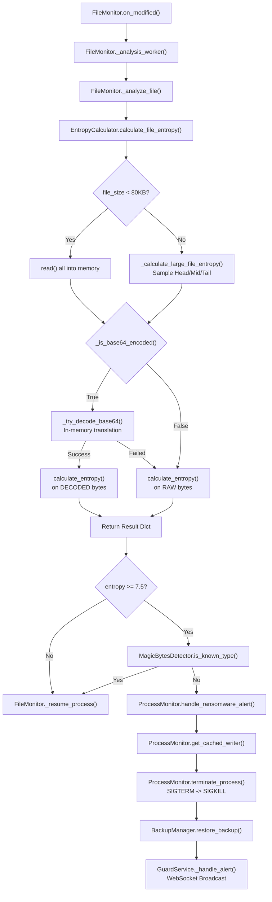

# Ransomware Guard — Function-Level Detection Flow

This document provides a deep dive into the exact function calls across the Python modules from detection to termination, including the Base64 evasion protection mechanism.

