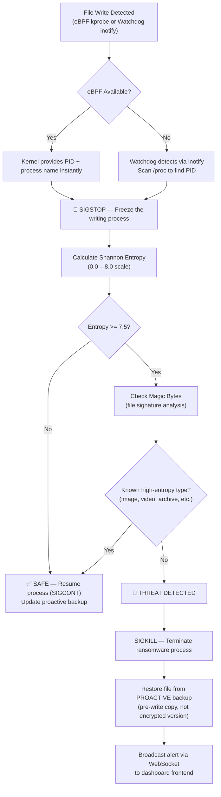

# 🛡️ Ransomware Guard — Project Documentation

> **Entropy-based ransomware detection and prevention system for Linux**
> Real-time file monitoring with eBPF kernel hooks, Shannon entropy analysis, automatic process termination, and file restoration — presented through a Svelte dashboard with WebSocket-powered live alerts.

---

## Table of Contents

1. [Overview](#overview)
2. [Architecture](#architecture)
3. [Project Structure](#project-structure)
4. [Core Detection Pipeline](#core-detection-pipeline)
5. [Backend Core Modules](#backend-core-modules)
6. [Backend API Layer](#backend-api-layer)
7. [Frontend Dashboard](#frontend-dashboard)
8. [Technology Stack](#technology-stack)
9. [How to Run](#how-to-run)

---

## Overview

**Ransomware Guard** is a Linux-native security tool that monitors a directory for ransomware activity in real time. It detects suspicious file modifications by measuring **Shannon entropy** — encrypted/ransomware files produce near-maximum entropy (~7.99 out of 8.0), while normal documents have significantly lower values.

### Key Capabilities

| Feature | Description |
|---|---|
| **eBPF Kernel Hooks** | Hooks `vfs_write()`, `sys_enter_renameat2`, `sys_enter_unlinkat` via kprobes/tracepoints for kernel-level write detection with instant PID identification |
| **Watchdog Fallback** | User-space inotify monitoring via Python `watchdog` when eBPF is unavailable (no root, no BCC) |
| **SIGSTOP-First Strategy** | Immediately freezes (SIGSTOP) the writing process before entropy analysis, preventing further damage during the check |
| **Shannon Entropy Analysis** | Calculates byte-level entropy (0.0–8.0 scale) with Head/Mid/Tail sampling for large files |
| **Magic Bytes Detection** | Identifies 50+ file types by their binary signature to reduce false positives on naturally high-entropy files (images, videos, archives) |
| **Proactive Backups** | Pre-write file copies created on startup and refreshed periodically, so restoration uses the *original* content — not the encrypted version |
| **Reactive Backups** | On-demand backup when a write event is detected, before entropy analysis completes |
| **Automatic Process Termination** | Kills confirmed ransomware processes via SIGKILL with multi-strategy process identification |
| **File Restoration** | Automatically restores original files from proactive backups after threat neutralization |
| **Real-time Dashboard** | Svelte-based web UI with WebSocket live alerts, process monitoring, and guard control |
| **Interpreter-Aware Detection** | Script interpreters (python, node, java) are **not** trusted — ransomware can run as scripts |

---

## Architecture

```
┌─────────────────────────────────────────────────────────────────────┐
│                        FRONTEND (Svelte + Vite)                     │
│  ┌──────────────┐  ┌──────────────┐  ┌───────────────────────────┐ │
│  │ SecondaryBar  │  │  AlertList   │  │     ProcessView           │ │
│  │ (Start/Stop)  │  │ (Live Alerts)│  │ (Running Processes Table) │ │
│  └──────┬───────┘  └──────┬───────┘  └──────────┬────────────────┘ │
│         │ REST API         │ WebSocket            │ WebSocket        │
└─────────┼──────────────────┼─────────────────────┼──────────────────┘
          │                  │                     │
┌─────────▼──────────────────▼─────────────────────▼──────────────────┐
│                     BACKEND API (FastAPI + Uvicorn)                  │
│  ┌─────────────┐  ┌───────────────┐  ┌────────────────────────────┐│
│  │   routes.py  │  │ websocket.py  │  │   guard_service.py         ││
│  │ REST Endpoints│ │ConnectionMgr │  │ Lifecycle + Alert Handling  ││
│  └──────────────┘  └───────────────┘  └─────────┬──────────────────┘│
└─────────────────────────────────────────────────┼───────────────────┘
                                                  │
┌─────────────────────────────────────────────────▼───────────────────┐
│                        CORE DETECTION ENGINE                        │
│                                                                     │
│  ┌──────────────┐        ┌───────────────────┐                     │
│  │ EBPFMonitor   │──┐     │   FileMonitor      │                    │
│  │ (kprobe on    │  │     │ (Unified Monitor)   │                    │
│  │  vfs_write)   │  ├────▶│ (SIGSTOP Pipeline)  │                    │
│  ├──────────────┤  │     └────────┬──────────┘                     │
│  │ Watchdog      │──┘              │                                │
│  │ (inotify)     │           ┌─────▼──────┐                        │
│  └──────────────┘           │  Entropy    │                        │
│                              │ Calculator  │                        │
│  ┌──────────────┐           └─────┬──────┘                        │
│  │ ProcessMonitor│                 │                                │
│  │ (Find & Kill) │           ┌─────▼──────┐                        │
│  └──────────────┘           │ MagicBytes  │                        │
│                              │ Detector    │                        │
│  ┌──────────────┐           └─────┬──────┘                        │
│  │ BackupManager │                 │                                │
│  │ (Backup &     │◀────Restore─────┘                                │
│  │  Restore)     │                                                  │
│  └──────────────┘                                                  │
│                                                                     │
│  ┌──────────────┐                                                  │
│  │ logger.py     │  Centralized logging (console + file)            │
│  └──────────────┘                                                  │
└─────────────────────────────────────────────────────────────────────┘
```

---

## Project Structure

```
Ransomware_Guard/
├── start.sh                    # Tmux-based launcher (3-pane: status, backend, frontend)
├── backend/
│   ├── main.py                 # CLI entry point (standalone mode)
│   ├── requirements.txt        # Python dependencies
│   ├── core/                   # Detection engine
│   │   ├── EBPFMonitor.py      #   eBPF kprobe hooks on vfs_write, rename, unlink (655 lines)
│   │   ├── FileMonitor.py      #   Unified monitor + SIGSTOP analysis pipeline (869 lines)
│   │   ├── ProcessMonitor.py   #   Process identification & termination (687 lines)
│   │   ├── BackupManager.py    #   Proactive + reactive backup & restore (437 lines)
│   │   ├── EntropyCalculator.py#   Shannon entropy with Head/Mid/Tail sampling (151 lines)
│   │   ├── MagicBytesDetector.py#  50+ file type signatures for false-positive reduction (346 lines)
│   │   └── logger.py           #   Centralized logging configuration (101 lines)
│   ├── app/                    # API layer
│   │   ├── main.py             #   FastAPI app factory, CORS, middleware (111 lines)
│   │   ├── routes.py           #   REST endpoints (170 lines)
│   │   ├── schemas.py          #   Pydantic request/response models (100 lines)
│   │   ├── websocket.py        #   WebSocket connection manager (88 lines)
│   │   └── services/
│   │       └── guard_service.py#   Guard lifecycle, alert handling, process broadcast (234 lines)
└── frontend/                   # Dashboard UI
    ├── package.json
    ├── vite.config.js
    ├── index.html
    └── src/
        ├── main.ts             #   Svelte entry point
        ├── App.svelte          #   Root component with WebSocket + routing (299 lines)
        └── components/
            ├── SecondaryBar.svelte  # Guard controls (start/stop, path input, stats)
            ├── AlertList.svelte     # Live alert table with threat details
            └── ProcessView.svelte   # Running process list with protection status
```

**Total codebase: ~6,092 lines** across source files (excluding `node_modules` and `.venv`).

---

## Core Detection Pipeline

The detection pipeline follows a **SIGSTOP-first strategy** — the writing process is frozen *immediately* before entropy analysis, preventing further damage during the check.

### 1. High-Level Architecture Flow



### 2. Function-Level Deep Dive

For a detailed map of the exact function calls across the Python modules from detection to termination, including the Base64 evasion protection, please see **[DETECTION_FLOW.md](./DETECTION_FLOW.md)**.

### Proactive Backup System

Unlike reactive backups (taken *after* a write), proactive backups are taken **before** any modification:

1. **On startup** — walks the entire watched directory and copies every file
2. **Periodically** — refreshes every 5 minutes (configurable) to capture new files
3. **On safe write** — when a write passes entropy check, the proactive backup is updated with the new content

This ensures that when ransomware is detected, the restoration uses the **original unencrypted content**.

---

## Backend Core Modules

### `EBPFMonitor.py` — Kernel-Level File Write Detection

| Aspect | Detail |
|---|---|
| **Mechanism** | Compiles and injects eBPF C code into the Linux kernel at runtime via BCC |
| **Hooks** | `vfs_write()` (kprobe), `sys_enter_renameat2` (tracepoint), `sys_enter_unlinkat` (tracepoint) |
| **Data captured** | PID, UID, process name, filename (basename from dentry), byte count, rapid-write flag |
| **Path resolution** | Reads `/proc/<pid>/fd` symlinks in user-space (dentry chain walks exceed eBPF verifier complexity limits) |
| **Anomaly detection** | Per-PID write counter; flags "rapid writes" when a PID exceeds 50 writes |
| **Requirements** | Linux kernel ≥ 4.15 with BPF support, root privileges, BCC library |
| **Fallback** | If unavailable, `is_available()` returns `False` → system uses Watchdog |

**Key classes:** `EBPFMonitor`, `EBPFFileEvent`

---

### `FileMonitor.py` — Unified File System Monitor

The central orchestrator that ties everything together.

| Aspect | Detail |
|---|---|
| **Backend selection** | Auto-selects: eBPF (primary) or Watchdog (fallback) |
| **SIGSTOP pipeline** | Freezes writers via `os.kill(pid, signal.SIGSTOP)` before entropy analysis |
| **Event queue** | Producer-consumer pattern (max 1,000 events) decouples detection from analysis |
| **Debouncing** | 1-second window prevents analyzing the same file repeatedly |
| **PID cache** | Cross-references eBPF PID data with Watchdog events |
| **eBPF path resolution** | 3-strategy approach: `/proc/<pid>/fd` → `/proc/<pid>/cwd` + basename → directory walk |
| **Ransomware extension detection** | Recognizes `.encrypted`, `.locked`, `.crypto`, `.crypt`, `.enc`, `.ransom`, `.pay`, `.locky` |

**Key classes:** `FileMonitor`, `_WatchdogHandler`

---

### `EntropyCalculator.py` — Shannon Entropy Analysis

| Aspect | Detail |
|---|---|
| **Algorithm** | Standard Shannon entropy: `H = -Σ p(x) * log₂(p(x))` for each byte value (0–255) |
| **Range** | 0.0 (all identical bytes) to 8.0 (perfectly random) |
| **Default threshold** | 7.5 (configurable) — values above this are considered suspicious |
| **Small files** | Read entirely into memory (< 80KB) |
| **Large files** | Head/Mid/Tail sampling — reads 3 chunks (8KB each) from start, middle, and end |
| **Risk levels** | `low` (< 6.0), `medium` (6.0–6.99), `high` (7.0–7.49), `extreme` (≥ 7.5) |

**Key class:** `EntropyCalculator`

---

### `ProcessMonitor.py` — Process Identification & Termination

| Aspect | Detail |
|---|---|
| **Process finding** | 3-tier strategy: (1) cache lookup, (2) live `/proc` file handle scan, (3) directory-based writer search |
| **Process tracking cache** | Maps `{file_path: [(pid, name, timestamp)]}` — captured *immediately* when write events occur, before handles close |
| **Protection lists** | 30+ system-critical processes that are **never** terminated (systemd, Xorg, NetworkManager, etc.) |
| **Trusted applications** | Browsers, office apps, compilers, package managers, backup tools — skipped unless flagged |
| **Script interpreters** | Python, Node, Java, Ruby, Perl, Bash, etc. are explicitly **not** trusted |
| **Termination** | SIGTERM → wait 3s → SIGKILL if still alive |
| **eBPF integration** | `handle_ransomware_alert_with_pid()` — uses PID directly from kernel, skipping expensive `/proc` scanning |

**Key classes:** `ProcessMonitor`, `ProcessInfo`, `ProcessAction`

---

### `BackupManager.py` — Automatic File Backup & Restore

| Aspect | Detail |
|---|---|
| **Backup types** | **Proactive** (pre-write, `.proactive.RGswap`) and **Reactive** (post-detection, timestamped `.RGswap`) |
| **Storage location** | Hidden directory `.ransomware_guard_backups/` alongside watched files |
| **Integrity** | SHA-256 hash stored in `.meta.json` metadata files; verified on restore |
| **File preservation** | `shutil.copy2()` preserves permissions, timestamps, and metadata |
| **Cleanup** | Stale backups older than 24 hours auto-removed; all backups cleaned on guard stop |
| **Optimization** | Proactive backups skip re-copying if file mtime hasn't changed |

**Key class:** `BackupManager`

---

### `MagicBytesDetector.py` — File Type Identification

| Aspect | Detail |
|---|---|
| **Purpose** | Reduces false positives by identifying legitimate high-entropy files |
| **Approach** | Reads first 16 bytes and matches against 50+ known file signatures |
| **Categories** | image, video, audio, archive, document, binary, database, font, disk_image |
| **Key insight** | Encrypted/ransomware files have **no** valid magic bytes — they appear as random garbage from byte 0 |
| **Extension mismatch detection** | Warns if the file extension doesn't match the detected magic bytes (possible disguise) |
| **Special handling** | Distinguishes MP4 vs ISO (`ftyp` box check), WAV vs WebP vs AVI (RIFF subtypes) |

**Key class:** `MagicBytesDetector`

---

### `logger.py` — Centralized Logging

Configures a unified `ransomware_guard` logger hierarchy with console output (INFO+) and daily rotating file output (DEBUG+). Log files stored in `backend/logs/`.

---

## Backend API Layer

### FastAPI Application (`app/main.py`)

- **Framework:** FastAPI with Uvicorn ASGI server
- **CORS:** Enabled for all origins (development mode)
- **Process title:** Sets `Ransomware-Guard` via `setproctitle` for easy identification
- **Request logging:** Middleware logs all POST request bodies

### REST Endpoints (`app/routes.py`)

| Method | Path | Description |
|---|---|---|
| `GET` | `/` | Health check |
| `GET` | `/api/status` | Guard running state, watch path, uptime, WebSocket clients |
| `GET` | `/api/stats` | Detection statistics (threats, terminations, alerts) |
| `GET` | `/api/alerts` | All alerts (optional `?limit=N`) |
| `GET` | `/api/processes` | Running process list with protection/trust status |
| `GET` | `/api/processes/action-log` | Log of terminated/suspended processes |
| `POST` | `/api/guard/start` | Start monitoring a directory (body: `watch_path`, `entropy_threshold`) |
| `POST` | `/api/guard/stop` | Stop monitoring |


### WebSocket (`app/websocket.py`)

| Endpoint | Message Types |
|---|---|
| `ws://host/ws/alerts` | `alert` (new threat), `stats` (updated counts), `status` (guard state change), `processes` (live process list every 5s) |

### Guard Service (`app/services/guard_service.py`)

Bridges the core detection engine with the API layer:
- Manages `FileMonitor` + `ProcessMonitor` lifecycle
- Handles alert storage and WebSocket broadcasting (thread-safe via `asyncio.run_coroutine_threadsafe`)
- Periodically broadcasts the full process list to connected WebSocket clients

---

## Frontend Dashboard

**Stack:** Svelte 4 + TypeScript + Vite 5

### Components

| Component | Purpose |
|---|---|
| `App.svelte` | Root layout — header with tabs (Dashboard / Processes), WebSocket connection, data fetching |
| `SecondaryBar.svelte` | Guard controls — start/stop buttons with loading state, watch path input, entropy threshold slider, stat badges (threats detected, processes killed) |
| `AlertList.svelte` | Real-time alert table — file path, entropy value, process name/PID, action taken, timestamp |
| `ProcessView.svelte` | Running process table — PID, name, exe, CPU/memory usage, protection/trust status badges |

### Design

- **Dark theme** — `#0a0a0a` background with grayscale + cyan (`#00ffcc`) accent
- **Typography** — Jersey 10 for headings, system font stack for body
- **Icons** — Lucide Svelte (`BrickWallShield`, `LayoutDashboard`, `Cpu`)
- **WebSocket reconnection** — auto-reconnects after 3 seconds on disconnection


### Backend

| Component | Technology |
|---|---|
| Language | Python 3.8+ |
| API Framework | FastAPI 0.109+ |
| ASGI Server | Uvicorn 0.27+ |
| eBPF | BCC (BPF Compiler Collection) with kprobes |
| File Monitoring | watchdog 3.0+ (inotify on Linux) |
| Process Management | psutil 5.9+ |
| Data Validation | Pydantic 2.0+ |

### Frontend

| Component | Technology |
|---|---|
| Framework | Svelte 4.2 |
| Build Tool | Vite 5.0 |
| Language | TypeScript 5.0 |
| Icons | lucide-svelte 0.577 |

### Infrastructure

| Component | Technology |
|---|---|
| Process Manager | tmux (3-pane layout for dev) |
| Shell Scripts | Bash (`start.sh`, `.tmux_*.sh`) |

---

## How to Run

### Prerequisites

- **Linux** (kernel ≥ 4.15 for eBPF; Watchdog fallback works on any OS)
- **Python 3.8+**, **Node.js**, **npm**, **tmux**
- **Root** (recommended for eBPF + process termination)
- **BCC** (optional): `sudo apt install python3-bpfcc linux-headers-$(uname -r)`

### Quick Start (tmux)

```bash
cd Ransomware_Guard
chmod +x start.sh
./start.sh
```

This launches a tmux session with 3 panes:
- **Status** — System info
- **Backend** — Uvicorn server on `:8000`
- **Frontend** — Vite dev server on `:5173`

### Manual Start

```bash
# Backend
cd backend
python3 -m venv .venv
source .venv/bin/activate
pip install -r requirements.txt
uvicorn app.main:app --host 0.0.0.0 --port 8000

# Frontend (separate terminal)
cd frontend
npm install
npm run dev
```

### CLI Standalone Mode

```bash
sudo python3 backend/main.py /path/to/protect --threshold 7.5 --log-level INFO
```


